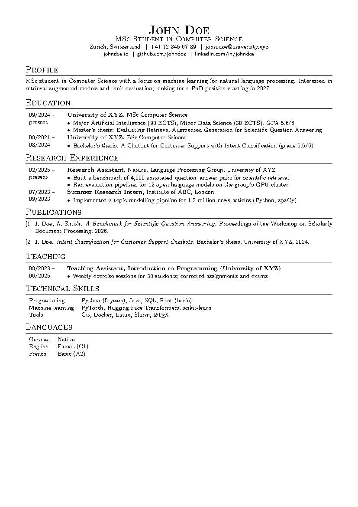
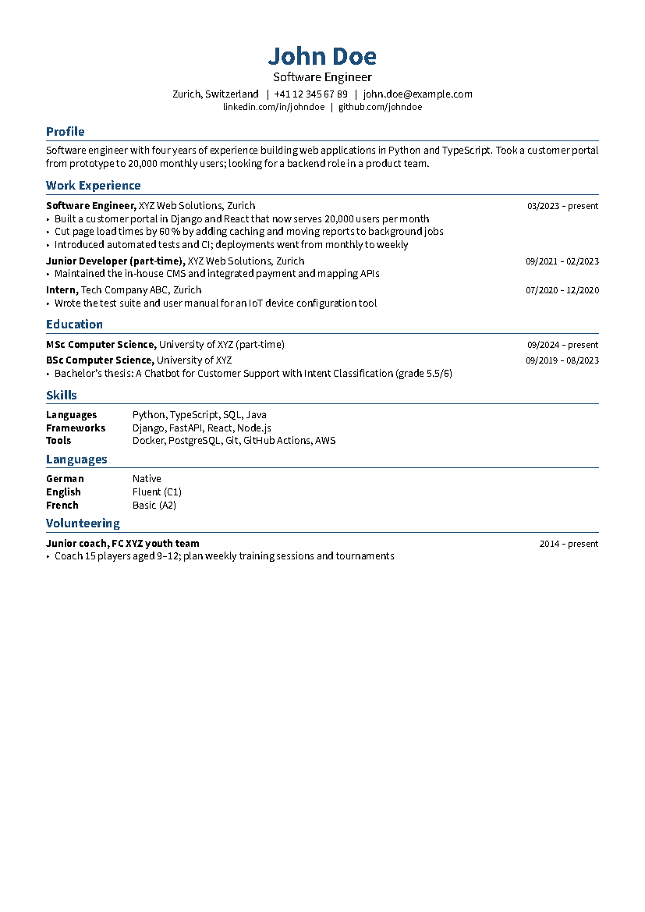

<div align="center">

# minimalistic-cv-template

**A one-column LaTeX CV in two styles: academic and corporate**


[](https://github.com/HuberNicolas/minimalistic-cv-template/actions/workflows/build.yml)


[Preview](#preview) · [Quick start](#quick-start) · [Commands](#commands) · [Writing tips](#writing-tips) · [PDF](https://github.com/HuberNicolas/minimalistic-cv-template/releases/latest)

</div>

## Features

- 🎓 **Academic style:** Computer Modern, small-caps headings, dates in a left column; for research, PhD and
  technical applications
- 💼 **Corporate style:** Source Sans, accent color, dates right-aligned on the title line; for applications to
  companies
- 📄 One column on A4 with 1.5 cm margins, month/year dates, a contact line with location and profile links
- 🔤 Machine-readable text (real spaces, Unicode mappings), so applicant tracking systems can parse the PDF
- 🧩 One class, one option: `\documentclass[academic]{cv}` or `\documentclass[corporate]{cv}`
- 🤖 GitHub Actions builds both PDFs on every push and attaches them to releases

> [!NOTE]
> Created in 2023 and updated in 2026 (v2). v2.1 adds the two styles, the `\cvheader` command, wider margins and
> machine-readable text. Existing v1 CVs still compile: `\centeredheader` and all entry commands keep their
> signatures.

## Contents

- [Preview](#preview)
- [Which style?](#which-style)
- [Repository structure](#repository-structure)
- [Quick start](#quick-start)
- [Commands](#commands)
- [Customisation](#customisation)
- [Writing tips](#writing-tips)
- [Build in CI](#build-in-ci)
- [License](#license)
- [Author](#author)

## Preview

| Academic | Corporate |
|---|---|
| [](template-academic.tex) | [](template-corporate.tex) |

Both PDFs are attached to every [release](https://github.com/HuberNicolas/minimalistic-cv-template/releases) and to
each [workflow run](https://github.com/HuberNicolas/minimalistic-cv-template/actions/workflows/build.yml).

## Which style?

| | Academic | Corporate |
|---|---|---|
| For | PhD and research positions, technical roles, academia | Companies, HR screening, recruiters |
| Order of sections | Profile, Education, Research, Publications, Teaching, Skills | Profile, Work experience, Education, Skills |
| Dates | Left column, start over end | Right-aligned on the title line |
| Length | Two pages are fine | One page for up to ~5 years of experience |

## Repository structure

| Path | Content |
|---|---|
| [`cv.cls`](cv.cls) | Document class: both styles, layout, fonts and the CV commands |
| [`template-academic.tex`](template-academic.tex) | Example CV in the academic style |
| [`template-corporate.tex`](template-corporate.tex) | Example CV in the corporate style |
| [`.latexmkrc`](.latexmkrc) | latexmk settings (pdfLaTeX, both templates as default files) |
| [`.github/workflows/build.yml`](.github/workflows/build.yml) | Builds both PDFs and attaches them to releases |
| [`docs/`](docs) | Preview images shown above |

## Quick start

### Overleaf

1. Download `cv.cls` and one of the templates (or the repository as ZIP).
2. In [Overleaf](https://www.overleaf.com/), choose **New Project → Upload Project** and upload the files.
3. Keep the compiler at **pdfLaTeX** (Menu → Settings) and edit the template.

### Local

You need a TeX distribution with `latexmk`, e.g. [TeX Live](https://tug.org/texlive/) or
[MacTeX](https://tug.org/mactex/). A full installation contains every package the class uses.

1. Clone the repository:

   ```bash
   git clone git@github.com:HuberNicolas/minimalistic-cv-template.git
   ```

2. Build both examples (`.latexmkrc` selects pdfLaTeX):

   ```bash
   latexmk
   ```

3. Rebuild one file on every save while you edit:

   ```bash
   latexmk -pvc template-corporate.tex
   ```

4. Remove the build files:

   ```bash
   latexmk -c
   ```

To start your own CV, copy a template to `cv.tex` and build it with `latexmk cv.tex`. The
[`.gitignore`](.gitignore) keeps `cv.tex`, `cv-de.tex` and `cv-en.tex` out of Git.

### Docker

Without a local TeX installation, build with the official TeX Live image (several GB):

```bash
docker run --rm -v "$PWD":/w -w /w texlive/texlive:latest latexmk
```

> [!IMPORTANT]
> Use **pdfLaTeX** for the CV you send out. XeLaTeX and LuaLaTeX also compile, but with Source Sans their PDFs lose
> the spaces between words when parsed (`Softwareengineerwith…`), which hurts applicant tracking systems.

## Commands

| Command | Use |
|---|---|
| `\cvheader{name}{subtitle}{contact line}{links line}` | Centered header; separate items with `\cvsep`, leave a line empty to drop it |
| `\email{address}` | `mailto:` link |
| `\weblink{github.com/user}` | Link without `https://` in the text |
| `\dtList{start}{end}{title}{text}{items}` | Entry with a bold title, normal text after it and bullet items |
| `\tList{start}{end}{title}{items}` | Entry with a bold title and bullet items |
| `\skillEntry{label}{value}` | One row of a skill or language table |
| `\centeredheader{name}{subtitle}{phone}{email}{website}` | v1 header, kept for existing CVs |

- Entries are rows of a two-column `tabular` (`{ll}`) inside `table[H]`, as in the templates.
- `items` is a list of `\item …`; leave it empty (`{}`) for an entry without bullets.
- Leave `end` empty (`{}`) for a single date; the dash is then left out.

```latex
\cvheader{John Doe}{Software Engineer}
  {Zurich, Switzerland \cvsep +41 12 345 67 89 \cvsep \email{john.doe@example.com}}
  {\weblink{linkedin.com/in/johndoe} \cvsep \weblink{github.com/johndoe}}

\section*{Work Experience}
\begin{table}[H]
    \begin{tabular}{ll}
        \dtList{03/2023}{present}{Software Engineer,}{XYZ Web Solutions, Zurich}{%
            \item Cut page load times by 60\,\% by adding caching
        } \\
    \end{tabular}
\end{table}
```

## Customisation

| What | Where |
|---|---|
| Style | `\documentclass[academic]{cv}` or `\documentclass[corporate]{cv}` |
| Font size | Class option, e.g. `\documentclass[corporate, 11pt]{cv}` |
| Margins | `\geometry{margin=1.2cm}` in the preamble |
| Accent color | `\definecolor{cvaccent}{RGB}{0, 102, 102}` in the preamble |
| Date column width (academic) | `\setlength{\cvdatewidth}{2cm}` in the preamble |
| Skill label width (corporate) | `\setlength{\cvlabelwidth}{3cm}` in the preamble |
| Heading style | `\titleformat{\section}` in [`cv.cls`](cv.cls) |
| PDF title and author | `\title{…}` and `\author{…}` in the preamble |

## Writing tips

- **Start with a profile:** two sentences on who you are, what you have done and what you are looking for.
  Recruiters skim a CV in seconds.
- **Show results, not duties:** "Cut page load times by 60 %" says more than "Responsible for performance".
- **Use month and year** (03/2023 – present), so gaps and durations are clear.
- **Name concrete skills** instead of levels like "advanced": tools, years of use, projects.
- **Keep the order reverse-chronological** and the most relevant section first: work experience for companies,
  education and research for academia.
- **Check the text layer:** copy the PDF text into a plain editor; if words or spaces are missing, a parser will
  miss them too.

## Build in CI

[`build.yml`](.github/workflows/build.yml) compiles both templates with
[xu-cheng/latex-action](https://github.com/xu-cheng/latex-action) on every push and pull request and uploads the PDFs
as a workflow artifact. Pushing a tag `v*` also attaches them to a GitHub release.

## License

[MIT](LICENSE) © 2023 Nicolas Huber

## Author

**Nicolas Huber** · [GitHub](https://github.com/HuberNicolas)
