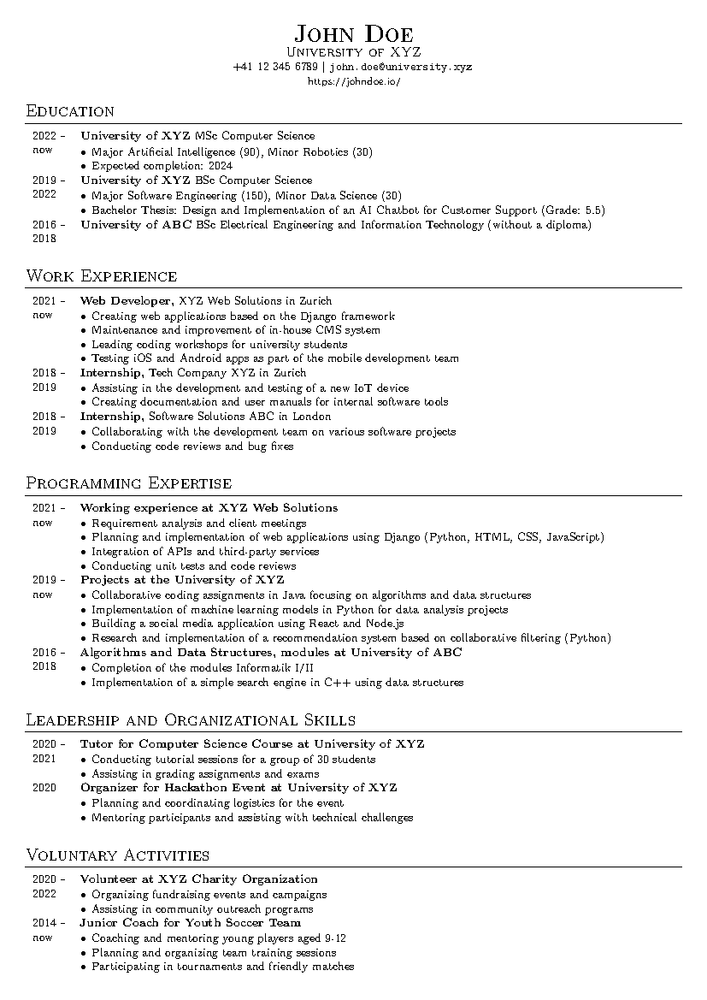

<div align="center">

# minimalistic-cv-template

**A one-column LaTeX CV with small-caps headings and compact, dated entries**


[](https://github.com/HuberNicolas/minimalistic-cv-template/actions/workflows/build.yml)


[Preview](#preview) · [Quick start](#quick-start) · [Commands](#commands) · [PDF](https://github.com/HuberNicolas/minimalistic-cv-template/releases/latest)

</div>

## Features

- 📄 Clean one-column layout on A4 with narrow margins
- 🗓️ Dated entries with a bold title, an optional description and a bullet list
- 🧩 Four commands cover all sections: `\centeredheader`, `\dtList`, `\tList`, `\skillEntry`
- 🔤 Real text in the PDF: selectable, searchable and readable by applicant tracking systems
- ⚙️ Compiles with pdfLaTeX (recommended), XeLaTeX and LuaLaTeX, locally or on Overleaf
- 🤖 GitHub Actions builds the PDF on every push and attaches it to releases

> [!NOTE]
> Created in 2023 and updated in 2026 (v2): the class now passes options to `article`, handles empty
> arguments safely, sets PDF metadata and builds in CI. The commands keep their v1 signatures, so existing CVs
> compile without changes.

## Contents

- [Preview](#preview)
- [Repository structure](#repository-structure)
- [Quick start](#quick-start)
- [Commands](#commands)
- [Customisation](#customisation)
- [Build in CI](#build-in-ci)
- [License](#license)
- [Author](#author)

## Preview

[](https://github.com/HuberNicolas/minimalistic-cv-template/releases/latest)

The full PDF is attached to every [release](https://github.com/HuberNicolas/minimalistic-cv-template/releases) and to
each [workflow run](https://github.com/HuberNicolas/minimalistic-cv-template/actions/workflows/build.yml).

## Repository structure

| Path | Content |
|---|---|
| [`cv.cls`](cv.cls) | Document class: layout, fonts and the CV commands |
| [`template.tex`](template.tex) | Example CV with placeholder content |
| [`.latexmkrc`](.latexmkrc) | latexmk settings (pdfLaTeX, `template.tex` as default file) |
| [`.github/workflows/build.yml`](.github/workflows/build.yml) | Builds the PDF and attaches it to releases |
| [`docs/preview.png`](docs/preview.png) | First page of the example, shown above |

## Quick start

### Overleaf

1. Download `cv.cls` and `template.tex` (or the repository as ZIP).
2. In [Overleaf](https://www.overleaf.com/), choose **New Project → Upload Project** and upload both files (or the ZIP).
3. Keep the compiler at **pdfLaTeX** (Menu → Settings) and edit `template.tex`.

### Local

You need a TeX distribution with `latexmk`, e.g. [TeX Live](https://tug.org/texlive/) or
[MacTeX](https://tug.org/mactex/). A full installation contains every package the class uses.

1. Clone the repository:

   ```bash
   git clone git@github.com:HuberNicolas/minimalistic-cv-template.git
   ```

2. Build the PDF (`.latexmkrc` selects pdfLaTeX and `template.tex`):

   ```bash
   latexmk
   ```

3. Rebuild on every save while you edit:

   ```bash
   latexmk -pvc
   ```

4. Remove the build files:

   ```bash
   latexmk -c
   ```

To build another file, pass its name, e.g. `latexmk cv.tex`. The [`.gitignore`](.gitignore) keeps `cv.tex`,
`cv-de.tex` and `cv-en.tex` out of Git, so you can keep your own CV next to the template.

### Docker

Without a local TeX installation, build with the official TeX Live image (several GB):

```bash
docker run --rm -v "$PWD":/w -w /w texlive/texlive:latest latexmk
```

## Commands

All commands go inside a two-column `tabular` (`{ll}`), as in [`template.tex`](template.tex).

| Command | Use |
|---|---|
| `\centeredheader{name}{subtitle}{phone}{email}{website}` | Centered header with a `mailto:` link and a web link |
| `\dtList{start}{end}{title}{text}{items}` | Entry with a bold title, normal text after it and bullet items |
| `\tList{start}{end}{title}{items}` | Entry with a bold title and bullet items |
| `\skillEntry{skill}{level}` | One row of a skill or language table |

- `items` is a list of `\item …`; leave it empty (`{}`) for an entry without bullets.
- Leave `end` empty (`{}`) for a single date; the dash is then left out.

```latex
\section*{Education}
\begin{table}[H]
    \begin{tabular}{ll}
        \dtList{2022}{now}{University of XYZ}{MSc Computer Science}{%
            \item Major Artificial Intelligence (90), Minor Robotics (30)
        } \\
        \dtList{2016}{2018}{University of ABC}{BSc Electrical Engineering}{} \\
    \end{tabular}
\end{table}
```

## Customisation

| What | Where |
|---|---|
| Paper and font size | Class options, e.g. `\documentclass[11pt]{cv}`; paper size and margins in the `geometry` line of [`cv.cls`](cv.cls) |
| Heading style | `\titleformat{\section}` and `\titlespacing{\section}` in [`cv.cls`](cv.cls) |
| Width of the text column | `p{0.9\linewidth}` in `\dtList` and `\tList` |
| PDF title and author | `\title{…}` and `\author{…}` in the preamble of your `.tex` file |

With XeLaTeX or LuaLaTeX the class loads `fontspec` (Latin Modern). Latin Modern has no bold small capitals, so the
name in the header falls back to bold upright; use pdfLaTeX for the original look.

## Build in CI

[`build.yml`](.github/workflows/build.yml) compiles `template.tex` with
[xu-cheng/latex-action](https://github.com/xu-cheng/latex-action) on every push and pull request and uploads the PDF
as a workflow artifact. Pushing a tag `v*` also attaches the PDF to a GitHub release.

## License

[MIT](LICENSE) © 2023 Nicolas Huber

## Author

**Nicolas Huber** · [GitHub](https://github.com/HuberNicolas)
